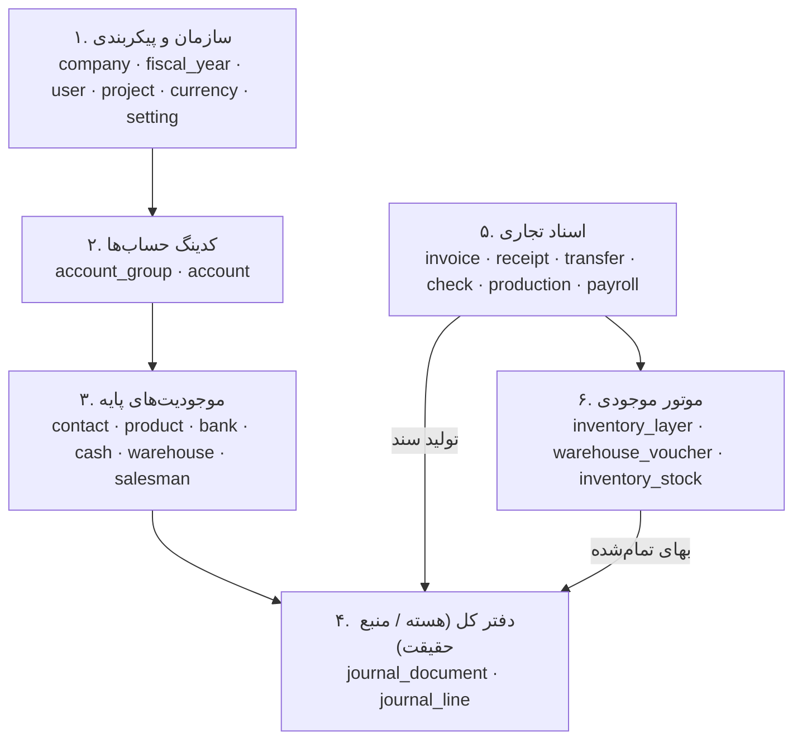
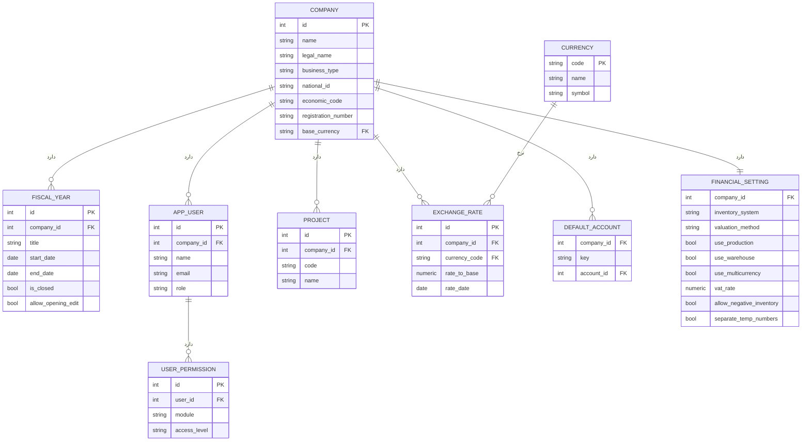
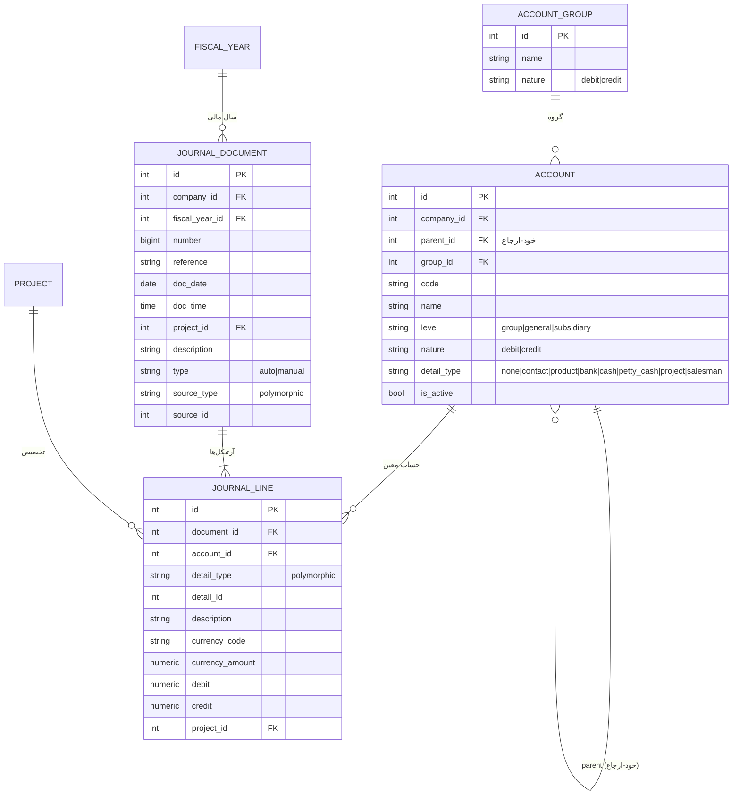
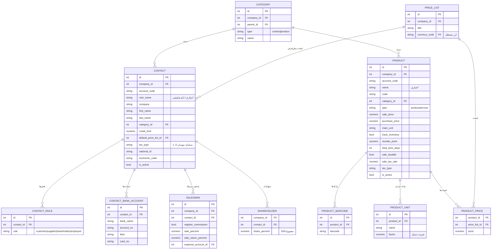
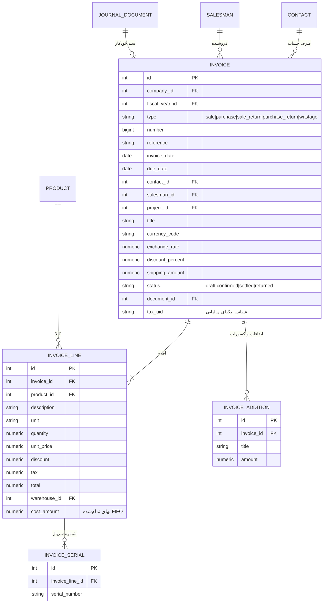
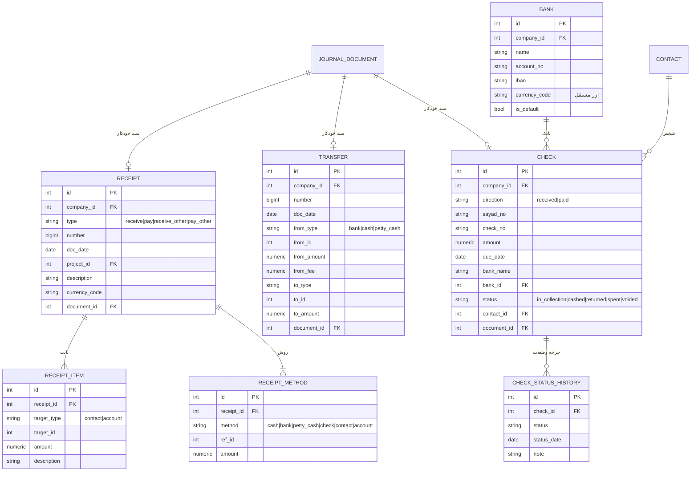
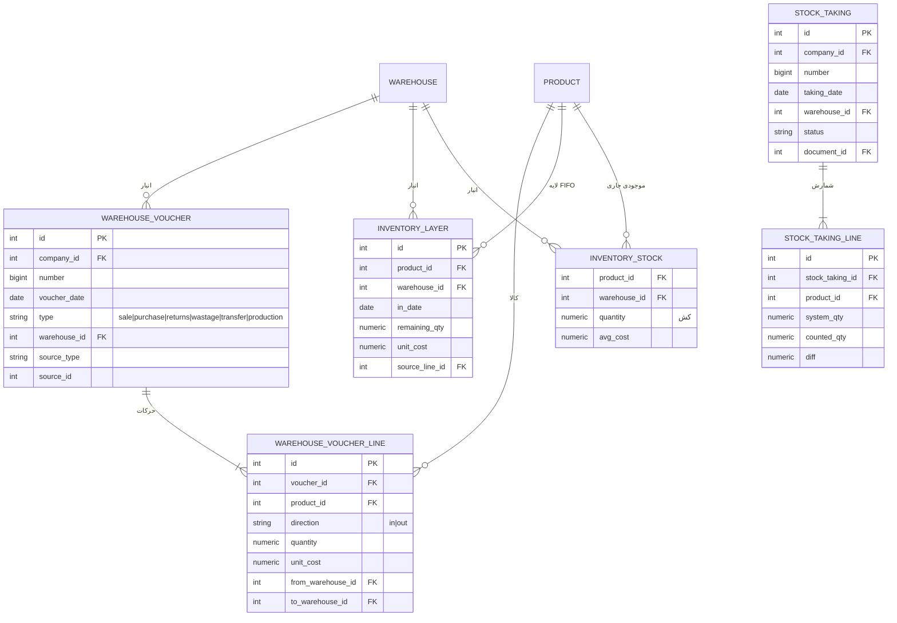
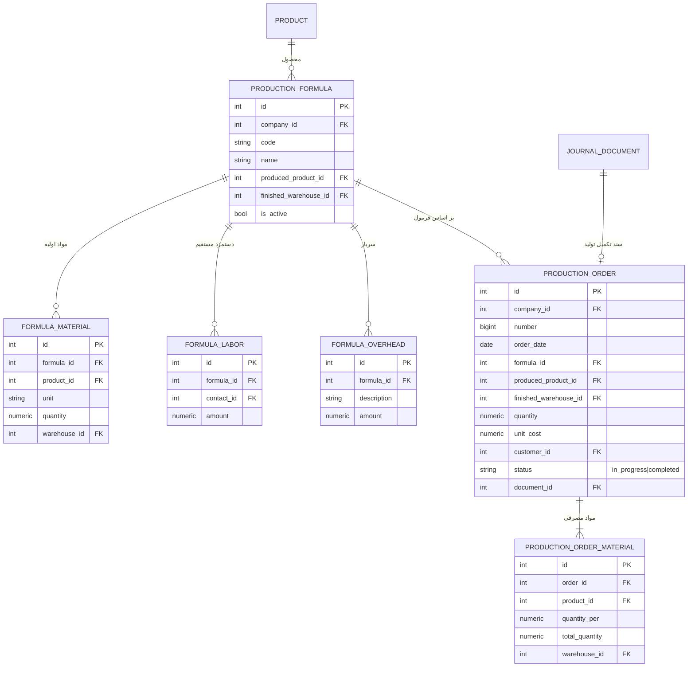
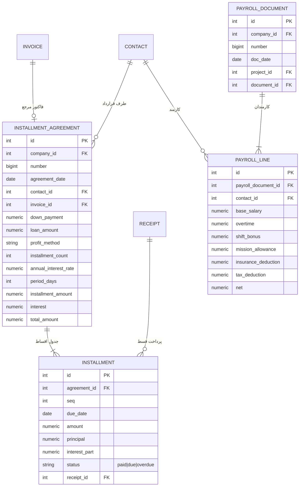
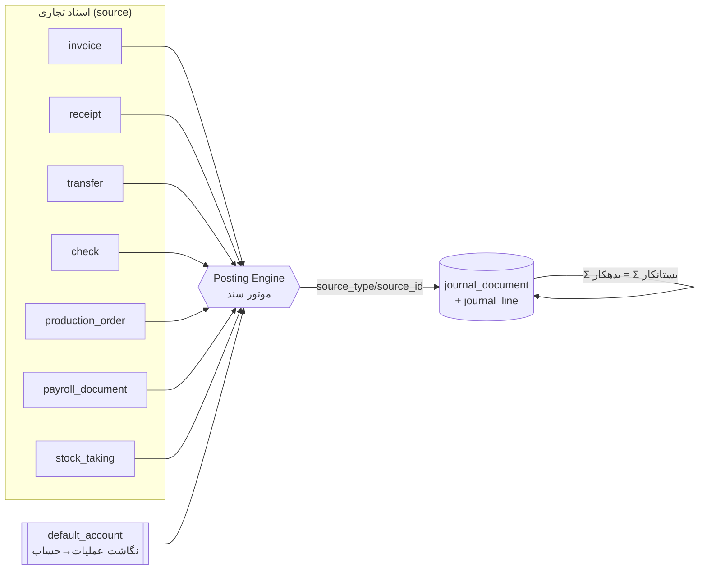

# طراحی دیتابیس سیستم حسابداری (ERD و منطق طراحی)

> مدل داده‌ی بک‌اند یک نرم‌افزار حسابداری تخصصی ایرانی (سبک حسابفا)، استخراج‌شده از مستندات `extraction-details.md` و اسکیل `accounting-system`.
> نمودارها با **Mermaid** رسم شده‌اند و در VSCode / GitHub رندر می‌شوند.
> پایگاه‌داده هدف: **PostgreSQL** — نوع پول `NUMERIC(24,4)`، تعداد `NUMERIC(20,4)`.

---

## فلسفه کلی

قلب سیستم یک **دفتر کل واحد** است. هر عملیات (فاکتور، دریافت، تولید، حقوق…) در نهایت به یک **سند حسابداری دو‌طرفه** تبدیل می‌شود و **تمام گزارش‌ها** از جدول `journal_line` محاسبه می‌شوند. یعنی `journal_line` تنها **منبع حقیقت (source of truth)** برای اعداد است.

### ۶ لایه‌ی معماری

---

## نمودار ۱ — سازمان و پیکربندی

**توضیح:** `company_id` روی همه جداول اصلی برای چند-شرکتی. `fiscal_year` مبنای بستن سال و انتقال مانده. `default_account` نگاشت *عملیات → حساب* است که موتور سند از آن می‌خواند (مثل `key='sales_receivable' → account_id`). دسترسی کاربر **تفکیکی per-module** با `user_permission`.

---

## نمودار ۲ — کدینگ حساب‌ها و هسته دفتر کل ⭐

**تصمیم‌های کلیدی این نمودار:**

1. **`account` خود-ارجاع است** (`parent_id`) تا سلسله‌مراتب *گروه ← کل ← معین* در یک جدول بماند؛ سطح با `level` مشخص می‌شود.
2. **تفصیل شناور (Floating Detail):** اشخاص و کالاها حساب جدا در جدول حساب‌ها **ندارند**. حساب معین با `detail_type` می‌گوید هنگام ثبت سند چه نوع تفصیلی لازم است، و `journal_line.detail_type + detail_id` (رابطه **چندریختی**) آن را به شخص/کالا/بانک/پروژه وصل می‌کند.
3. **قید طلایی:** برای هر سند `Σ debit = Σ credit` (با trigger تضمین می‌شود — سند نامتوازن ممنوع).
4. **مانده‌ها ذخیره نمی‌شوند، محاسبه می‌شوند:** مانده = `SUM(debit) − SUM(credit)`. برای سرعت می‌توان جدول کش `account_balance` افزود.
5. **`source_type/source_id`** سند حسابداری را به سند تجاری منشأ وصل می‌کند (دو‌طرفه).

---

## نمودار ۳ — موجودیت‌های پایه (اشخاص، کالا، قیمت)

**توضیح:**
- **نقش شخص یک‌به‌چند است** (`contact_role`) نه چند بولین، چون یک شخص هم‌زمان می‌تواند مشتری+تامین‌کننده باشد.
- **لیست قیمت پویا:** `product_price` رابطه‌ی **چند‌به‌چند** کالا×لیست‌قیمت است؛ هر `price_list` ارز مستقل دارد (قیمت دلاری، همکار، عمده…).
- شخص، کالا، بانک و… همگی «تفصیل شناور» برای `journal_line`اند.

---

## نمودار ۴ — فروش و خرید (فاکتور واحد)

**تصمیم مهم — یکپارچه‌سازی:** به‌جای ۵ جدول تقریباً یکسان، یک جدول `invoice` با ستون `type` (فروش/خرید/برگشت‌ها/ضایعات). ساختار همه یکسان است؛ فقط منطق سند و علامت‌ها فرق دارد. `cost_amount` روی هر سطر، بهای تمام‌شده‌ی محاسبه‌شده از لایه‌های FIFO را نگه می‌دارد.

---

## نمودار ۵ — بانکداری، دریافت/پرداخت، چک، انتقال

**توضیح:**
- **دریافت/پرداخت/هزینه/درآمد همه با `receipt` مدل می‌شوند.** `receipt_item.target_type` می‌گوید بابت *شخص* است یا *حساب* (هزینه/درآمد)؛ `receipt_method` روش دریافت را می‌دهد. پس **جدول جدا برای هزینه/درآمد لازم نیست**.
- **چرخه چک** با `status` روی خود چک + جدول تاریخچه `check_status_history` (در جریان وصول ← وصول/عودت/خرج).

---

## نمودار ۶ — موتور موجودی (FIFO + کاردکس)

**توضیح — چرا موجودی یک عدد ساده نیست:**
- **`inventory_layer`**: هر ورود یک لایه‌ی FIFO با `(remaining_qty, unit_cost, in_date)`؛ هر خروج لایه‌های قدیمی را به ترتیب مصرف می‌کند و بهای تمام‌شده را از آن‌ها برمی‌دارد.
- **`warehouse_voucher_line`**: منبع **کاردکس/کارت انبار** (همه حرکات ورود/خروج).
- **`inventory_stock`**: کش موجودی جاری برای سرعت.
- **بازمحاسبه:** چون ویرایش سوابق گذشته زنجیره‌ی FIFO را می‌شکند، منطق ارزیابی در یک سرویس متمرکز پیاده می‌شود تا قابل **recompute** باشد.

---

## نمودار ۷ — تولید

**توضیح:** فرمول تولید (BOM) سه جزء بهای تمام‌شده دارد: **مواد + دستمزد + سربار**. دستور تولید، مواد را از فرمول × تعداد تکثیر می‌کند و با تکمیل، سند «موجودی محصول = مواد+دستمزد+سربار» می‌زند.

---

## نمودار ۸ — اقساط و حقوق

**توضیح:** جدول اقساط با استهلاک (تفکیک اصل/سود) خودکار تولید می‌شود؛ هر پرداخت قسط به یک `receipt` وصل است. سند حقوق: هر ردیف کارمند، اجزای درآمد و کسورات را نگه می‌دارد و به سند «هزینه حقوق / حقوق پرداختنی / کسورات» تبدیل می‌شود.

---

## نمودار ۹ — یکپارچگی سند تجاری با دفتر کل (الگوی مرکزی)

**الگوی ثابت:** هر سند تجاری یک `document_id` دارد که به سند حسابداری تولیدشده اشاره می‌کند، و سند حسابداری با `source_type/source_id` به منشأ برمی‌گردد. موتور سند (Posting Engine) با کمک `default_account`، بدهکار/بستانکارها را می‌سازد.

---

## جدول تصمیم‌های طراحی

| موضوع | تصمیم | چرا |
|---|---|---|
| منبع حقیقت | فقط `journal_line`؛ مانده‌ها محاسبه می‌شوند | تراز همیشه درست؛ کش اختیاری برای سرعت |
| اشخاص/کالا | تفصیل شناور (`detail_type+detail_id`) نه حساب جدا | مثل کدینگ واقعی؛ بدون تکرار در جدول حساب |
| فاکتورها | جدول واحد `invoice` با `type` | ساختار یکسان، کاهش تکرار |
| دریافت/پرداخت/هزینه/درآمد | جدول واحد `receipt` با `type` + `target_type` | حذف جداول موازی |
| نوع پول | `NUMERIC(24,4)` هرگز `float` | ریال عدد بزرگ؛ بدون خطای گرد کردن |
| چند-ارزی | مبلغ پایه + `currency_code`+`currency_amount`+نرخ روی هر آرتیکل | تراز به پول پایه، گزارش ارزی جدا |
| موجودی | لایه‌های FIFO + کاردکس + کش | بهای تمام‌شده دقیق + قابلیت recompute |
| چند-شرکتی/سال مالی | `company_id` + `fiscal_year_id` روی اسناد | جداسازی و بستن سال |
| حذف | soft-delete (`is_active`/`deleted_at`) | یکپارچگی حسابداری و ردگیری |
| تراز سند | trigger روی `Σdebit=Σcredit` | جلوگیری از سند نامتوازن در سطح دیتابیس |
| پیوست | `attachment(entity_type, entity_id)` پلی‌مورفیک | آرشیو فایل هر موجودیت |

---

## ایندکس‌های پیشنهادی (کارایی)

- `journal_line(account_id, detail_type, detail_id)` — محاسبه مانده حساب/شخص/کالا
- `journal_line(document_id)` — بازیابی آرتیکل‌های سند
- `journal_document(company_id, fiscal_year_id, doc_date)` — دفتر روزنامه/بازه
- `journal_document(source_type, source_id)` — یافتن سند از روی سند تجاری
- `invoice(company_id, type, status, invoice_date)` — لیست‌ها و گزارش فروش/خرید
- `inventory_layer(product_id, warehouse_id, in_date)` — مصرف FIFO
- `inventory_stock(product_id, warehouse_id)` — موجودی جاری (کلید مرکب/PK)

---

## قدم بعدی

این سند، طرح مفهومی و منطق است. مرحله بعد می‌تواند **DDL کامل `CREATE TABLE`** (PostgreSQL با کلید/ایندکس/trigger تراز) باشد — بگو تا بسازم.
